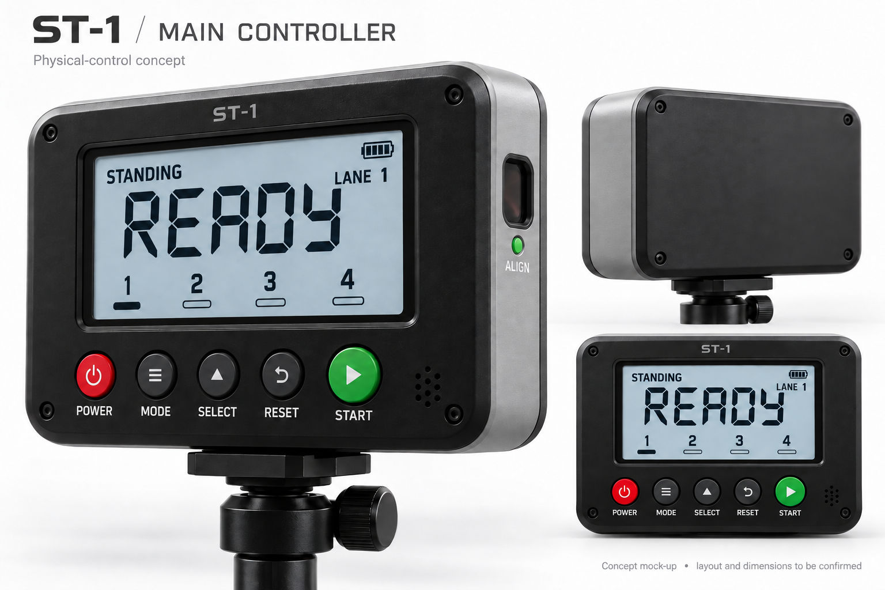
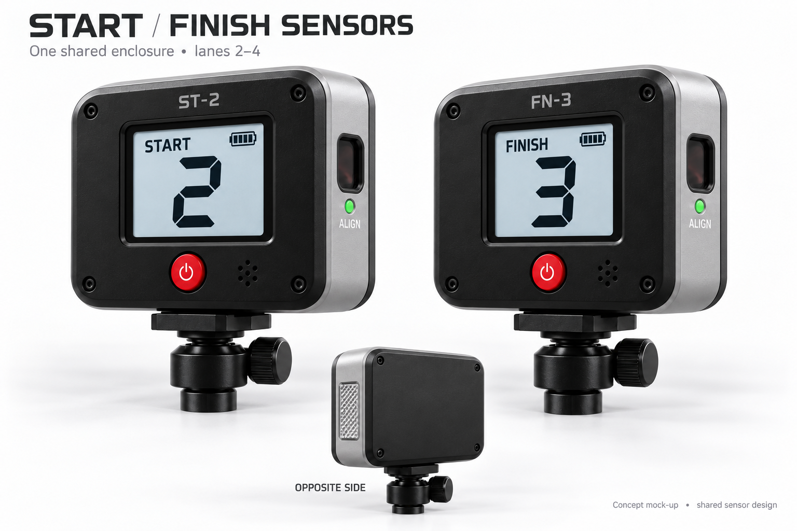
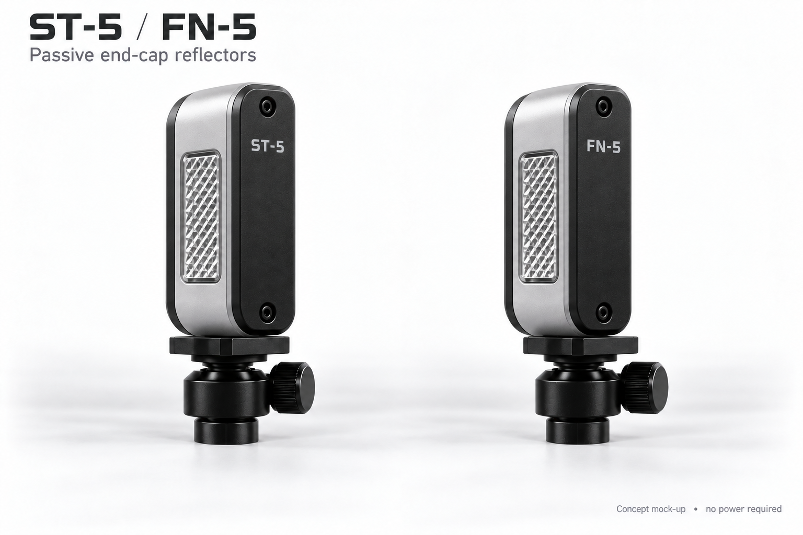
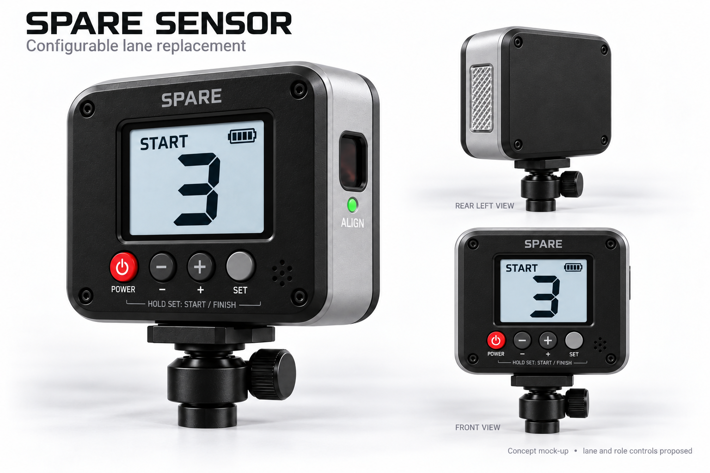
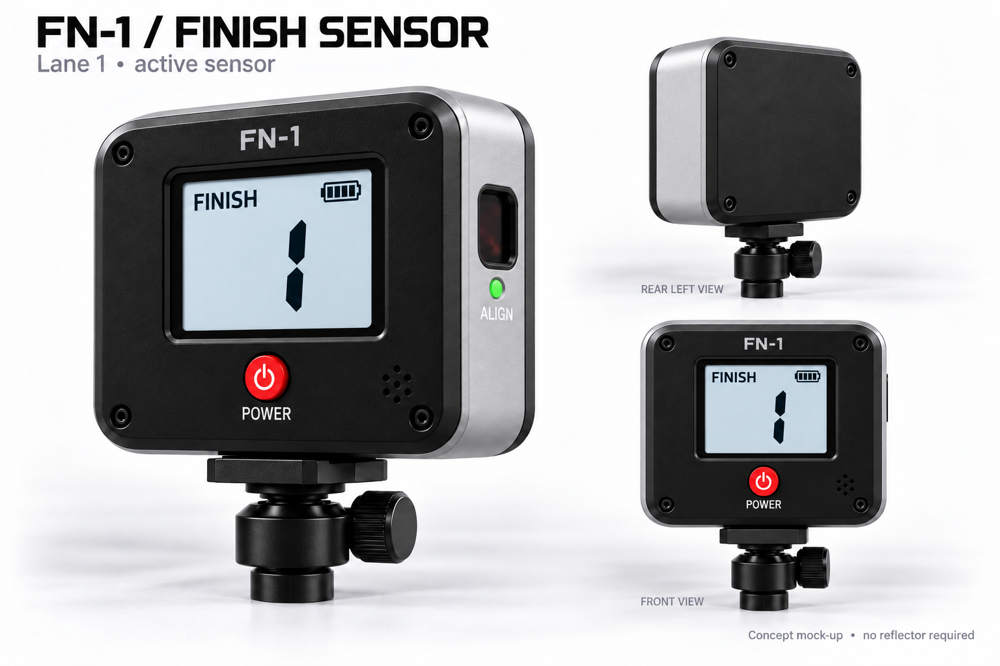
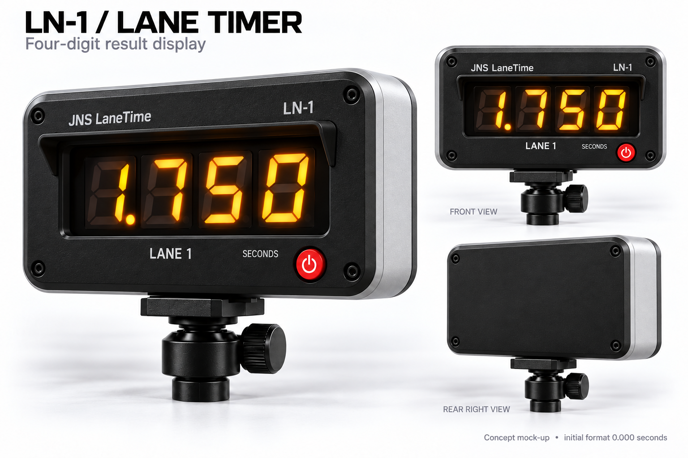
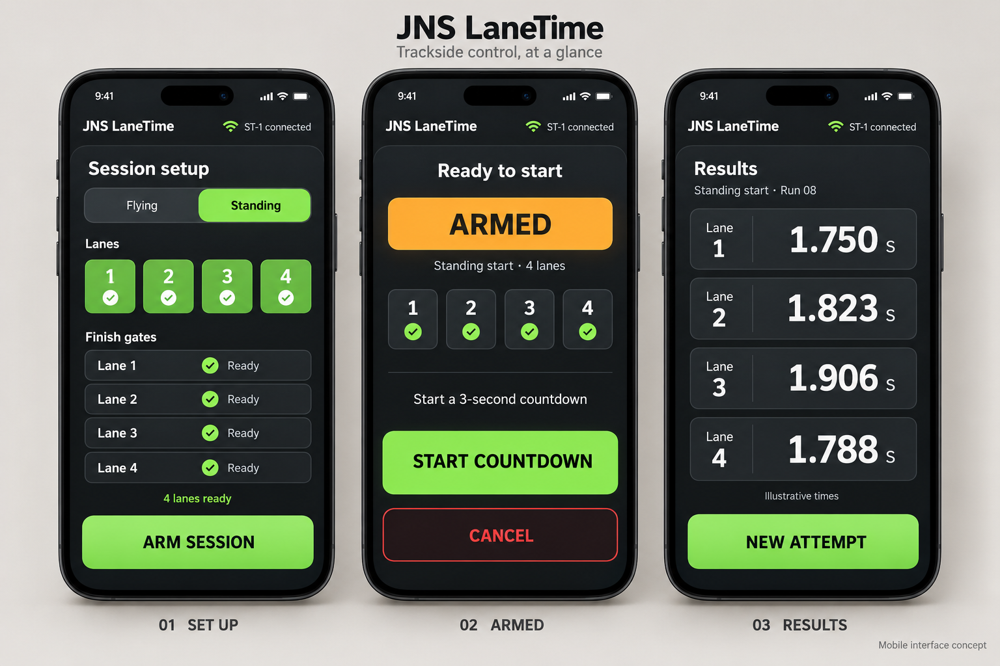

# Device and interface concept mock-ups

AI-generated visual concepts developed during design discussion. These depict the agreed design direction, not verified dimensions, component choices, or weatherproof construction. Only the current variants are included here.

## ST-1 main controller

Dedicated coach controller with active IR optics and no reflector. Button layout and screen details remain proposals.

## Shared lane sensors

ST-2–ST-4 and FN-2–FN-4 share a simple sensor design, with an active optical face and opposite-side reflector. Shown as ST-2 and FN-3.

## Passive end-caps

Slim, unpowered reflector units. ST-5/FN-5 are the four-lane layout identifiers, not a fifth timed lane.

## Configurable spare

Shared sensor form factor with lane and role controls. Does not replace ST-1; exact button interaction is proposed.

## FN-1 finish sensor

Simple lane 1 finish sensor with active optics and no reflector.

## Lane result displays

LN-1 shown with a four-digit LED readout of 1.750 seconds. The same enclosure design serves LN-2–LN-4 with matching lane labels. Initial format: `0.000` seconds; display resolution does not establish timing accuracy.

Four Neo7 Mini digit modules per case were the original prototype approach; cheaper off-the-shelf WS2812B matrix panels are now being weighed against them, and existing 8×8 RGB matrices may stand in for testing. Module dimensions, decimal-point provision, electrical requirements, and outdoor readability still need confirming. The shallow sun hood and amber colour are illustrative. A later change to `00.00`, or five digits for `00.000`, remains possible.

## Mobile interface concept

Three screens explore the future coach interface: session setup, armed/start controls, and lane results. The Standing-mode example uses large controls, clear lane status, and the charcoal-and-lime design language. Flying mode would wait for beam breaks instead of offering a countdown.

This is a visual concept, not an implemented mobile app or a change to the current physical-controller baseline. Connection indicators and times are illustrative; three decimal places do not establish timing accuracy. Phone/browser control remains deferred.

